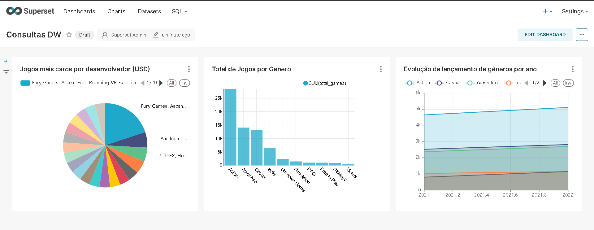

## Dashboard criado com consultas no Data Warehouse



### 1. Total de Jogos por Gênero

```sql
SELECT 
    g.genre_name,
    COUNT(DISTINCT f.game_key) AS total_games
FROM 
    public_marts.dim_genre g
JOIN 
    public_marts.fact_games f ON g.genre_key = f.primary_genre_key
GROUP BY 
    g.genre_name
ORDER BY 
    total_games DESC;
```

### 2. Jogos mais caros por desenvolvedor

```sql
SELECT 
    d.name AS developer_name,
    g.game_name,
    f.current_price AS price
FROM 
    public_marts.fact_games f
JOIN 
    public_marts.dim_game g ON f.game_key = g.game_key
JOIN 
    public_marts.dim_developer d ON f.primary_developer_key = d.developer_key
WHERE 
    f.current_price > 0
ORDER BY 
    f.current_price DESC, d.name
LIMIT 20;
```

### 3. Evolução de lançamentos por ano e gênero

```sql
SELECT 
    d.year_number AS ano,
    g.genre_name,
    COUNT(DISTINCT f.game_key) AS total_jogos
FROM 
    public_marts.fact_games f
JOIN 
    public_marts.dim_date d ON f.release_date_key = d.date_key
JOIN 
    public_marts.dim_genre g ON f.primary_genre_key = g.genre_key
GROUP BY 
    d.year_number, g.genre_name
ORDER BY 
    d.year_number, g.genre_name;
```

# Passo a Passo de como iniciar o Apache Superset

## Iniciar os serviços
```bash
docker-compose up -d superset
```

## Verificar logs
```bash
docker logs superset
```

## Acessar o Superset via navegador
**http://localhost:8088**

## Login
- **Username:** `admin`
- **Password:** `admin`